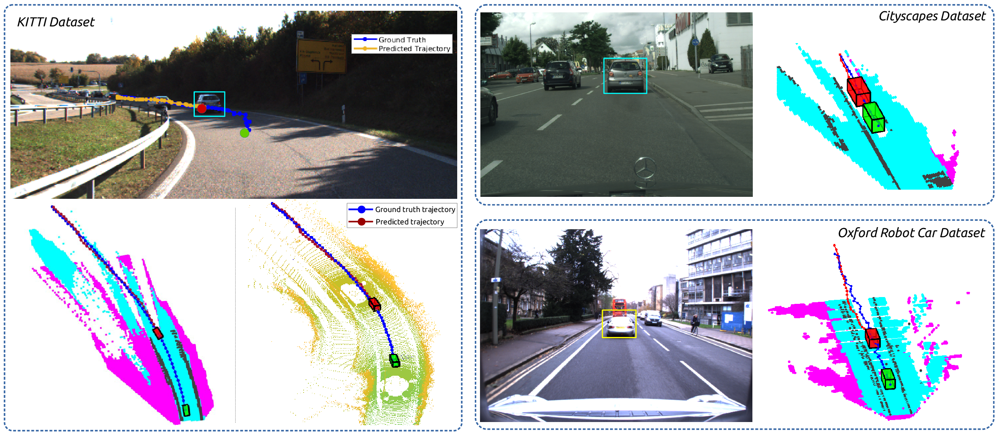

# INFER: INtermediate representations for FuturE pRediction



This repository contains code and data required to reproduce the results of **INFER: INtermediate representations for FuturE pRediction**. 
### Shashank Srikanth, [Junaid Ahmed Ansari](https://scholar.google.co.in/citations?user=Uc8mKqMAAAAJ&hl=en), [R. Karnik Ram](http://karnikram.info/), [Sarthak Sharma](https://scholar.google.com/citations?user=4uKV9aIAAAAJ&hl=en), [J. Krishna Murthy](https://krrish94.github.io), and [K. Madhava Krishna](http://robotics.iiit.ac.in)


### Datasets


In order to use this code, you need to download the intermediate representations datasets used by our network. The intermediate representation has 5 different channels as shown in the above figure which are generated using the semantic and instance segmentation of the image along with depth. Most of the channels are self explanatory and the other vehicles channel represents the position of the other vehicles in the scene. 

The intermediate representations have been generated for all the 3 datasets: KITTI, Cityscapes & Oxford RobotCar

The link to the dataset consisting of intermediate representations is given [here](https://drive.google.com/file/d/1XUchHU47P_0p9Y-WnwaGYqX6pve4wtaX/view?usp=sharing)

You can find the corresponding semantic, instance segmenation and disparity [here](https://drive.google.com/drive/folders/1gj3s4YxM1Qy9IKzEzJOPCMvv35yp66He?usp=sharing)

### Installations

The code has been tested with `python3` and `PyTorch 0.4.1`. 

In order to install all the required files, create a virtualenv and install the files given in `requirements.txt` file.

```
virtualenv -p python3.5 venv
source venv/bin/activate
pip install -r requirements.txt
```

### Running the demo scripts
In order to run our evaluation script for KITTI, run the file `infer-main.ipynb` after changing the appropriate paths of `repo_dir` and `data_dir` in the code. `repo_dir` refers to the absolute path of the repository root in your PC. `data_dir` refers to the absolute path of the corresponding dataset. 

The scipts for transfer to Cityscapes & Oxford can be run in the same way.

### Training

Training the network on a single split of KITTI takes about 8-10 hours in an NVIDIA GeForce GTX 1080Ti GPU.

You can run the training code as follows:

```
python train.py -expID split-0 -nepochs 60 -dataDir /home/username/kitti -optMethod adam -initType default -lr 0.000100 -momentum 0.900000 -beta1 0.90000 -modelType skipLSTM -groundTruth True -imageWidth 256 -imageHeight 256 -scaleFactor False -gradClip 10 -seqLen 1 -csvDir /home/pravin.mali/merged/final-validation/ -trainPath train0.csv -valPath test0.csv -minMaxNorm False
```

The different parameters available are given in the file `args.py`. In order to try the various ablation studies, you can set the arguments like `lane` to be false

### Pretrained Models

All other pretrained models are available on request. 